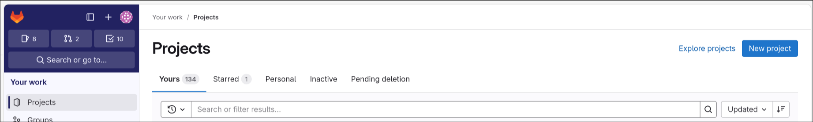
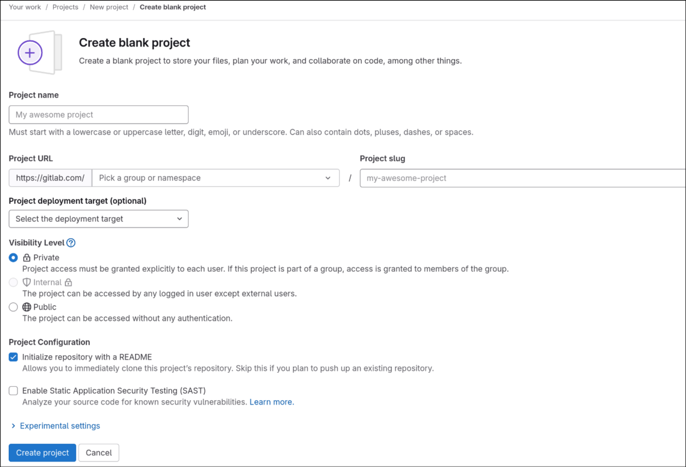

# Creating a remote

You have a repo on your own system now, but for others to access it you need it to also be in a remote location, like GitLab or Github, so that you can push code there for others to download from and vice versa.

Here, I'll guide you through making a new repo on GitLab and connecting it to your account

Start by heading to [gitlab.com](gitlab.com), and logging in/creating a new account. You should be lead to your project dashboard.

Click `New Project` in the top right, then select blank project.

You'll be lead here. Start by typing in:
1. Project name, this is self explanatory
2. Project URL, the slug part should fill out automatically once you type in the name, and set the group part to whatever you want it to be from the dropdown, such as `frc-team-4739/software-training`
